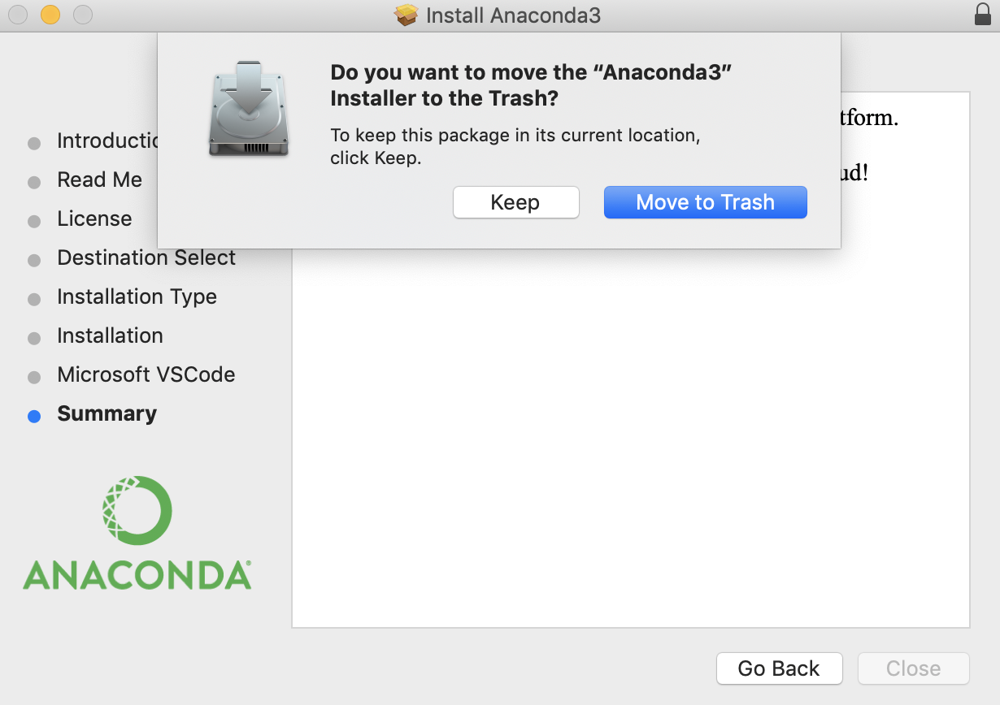
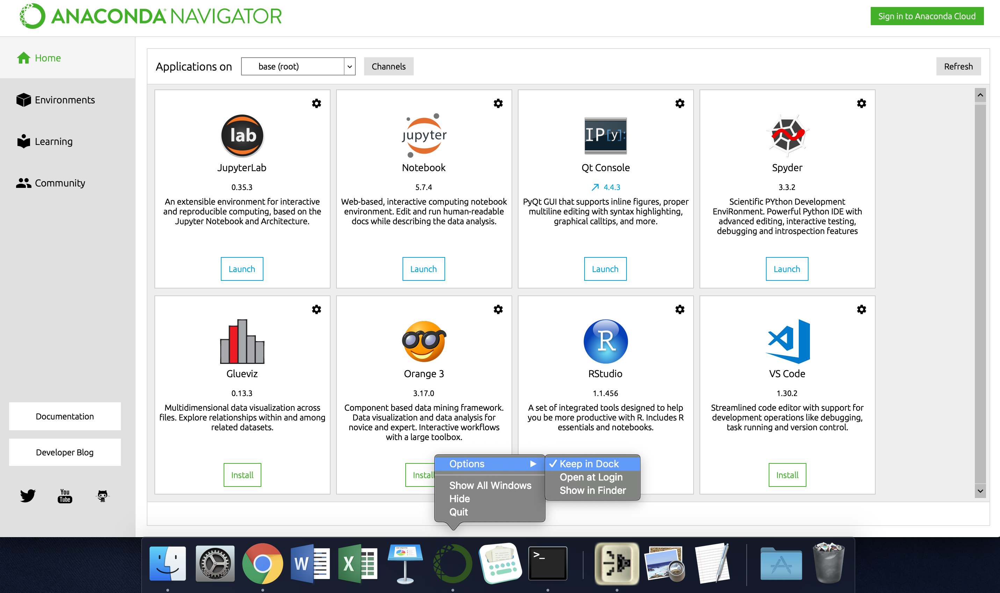

# CSCI 378: Recommended Computing Setup

## First steps

This course is taught using Python 3. We recommend the following setup:

1. Go to https://www.anaconda.com/download.
2. Choose whether you're using Windows, Mac, or Linux by clicking on the appropriate icon. This will give you a choice of files to download.

3. Click the big green download button beneath the Python 3.7 version.

## Next steps for Mac users

1. Open the downloaded file, which should be called something like Anaconda3-2018.12-MacOSX-x86_64.pkg.
2. You may be asked whether or not you trust the provider of this file. If so, click "Continue".

3. Follow the remainder of the instructions from the installer (accept the license agreement, etc.) Note that the installation may take several minutes. You need not bother installing Microsoft VSCode (if asked). At the end, feel free to move the installer to the trash (if asked).

4. To launch Anaconda Navigator, open a Finder window and then press Command+Shift+A. This will jump to the Applications menu. From here, open Anaconda Navigator by double-clicking on it.

5. To make it easier to open Anaconda Navigator in the future, you may wish to right-click on the Anaconda icon (a green circle) in the dock at the bottom of the screen. Then go to Options -> Keep in Dock. In the future, this will allow you to open the Anaconda Navigator by clicking on the Anaconda icon in the dock.

6. All done! Proceed to the section on "Using Anaconda Navigator and Spyder".

##  Next steps for Windows users

1. Open the downloaded file, which should be something like Anaconda3.something.exe.
2. Follow the setup prompts, taking all the default recommendations. The installation may take several minutes. You need not bother installing Microsoft VSCode (if asked). 
3. From the Start menu, click the Anaconda Navigator desktop app.

## Using Anaconda Navigator and Spyder

https://docs.anaconda.com/anaconda/user-guide/getting-started/

## Getting the right packages.

You will need torch and rpyc for this course. Install these from the terminal by typing:

    pip install torch
    pip install rpyc
